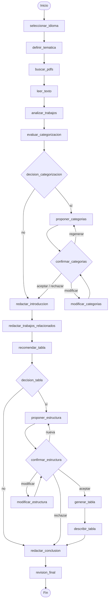

# AI Related Works Agent

Agente de IA basado en **LangGraph** que entrevista al usuario sobre su propio trabajo de
investigación, analiza un conjunto de PDFs de trabajos relacionados y redacta automáticamente la
sección **"Related Works"** completa de un paper científico — introducción, desarrollo por
trabajo (o agrupado por categorías temáticas), tabla comparativa opcional y conclusión — lista
para pegar en LaTeX, con `\cite{}` y bibliografía generados automáticamente.

Desarrollado como Trabajo de Fin de Grado (TFG).

---

## Índice

- [Descripción](#-descripción)
- [Características principales](#-características-principales)
- [Arquitectura del agente](#-arquitectura-del-agente)
  - [Estado del agente](#estado-del-agente-agentstate)
  - [Flujo del grafo](#flujo-del-grafo)
  - [Nodos y gateways](#nodos-y-gateways)
- [Estructura del proyecto](#-estructura-del-proyecto)
- [Requisitos previos](#-requisitos-previos)
- [Instalación](#-instalación)
- [Configuración](#-configuración)
  - [Modelos LLM](#modelos-llm)
  - [Variables de entorno](#variables-de-entorno)
  - [Carpeta de PDFs](#carpeta-de-pdfs)
- [Uso](#-uso)
  - [Antes de empezar](#antes-de-empezar)
  - [Interfaz de consola](#interfaz-de-consola)
  - [Interfaz web (Gradio)](#interfaz-web-gradio)
- [Flujo de uso paso a paso](#-flujo-de-uso-paso-a-paso)
- [Salidas generadas](#-salidas-generadas)
- [Generar el diagrama del grafo](#-generar-el-diagrama-del-grafo)
- [Tecnologías utilizadas](#-tecnologías-utilizadas)
- [Limitaciones conocidas](#-limitaciones-conocidas)
- [Autor](#-autor)
- [Licencia](#-licencia)

---

## Descripción

Redactar la sección "Related Works" de un paper es una tarea repetitiva y que consume mucho
tiempo: hay que leer cada trabajo relacionado, extraer su aportación, compararlo con el trabajo
propio y redactar todo con un registro académico coherente. Este agente automatiza ese proceso
combinando:

- **Extracción y análisis de PDFs** (`pypdf` + LLM) para generar una ficha técnica estructurada
  de cada trabajo (problema, metodología, aportaciones, limitaciones, casos de uso).
- **Un flujo conversacional guiado** en el que el usuario decide en varios puntos clave (idioma,
  categorización, tabla comparativa) y puede aceptar, regenerar o pedir modificaciones puntuales
  sobre lo que propone el agente.
- **Generación de contenido por LLM** en cada fase de la redacción (introducción, cuerpo,
  descripción de tabla, conclusión) con prompts fuertemente restringidos para mantener un
  registro académico homogéneo.
- **Ensamblado final en LaTeX**, con inserción automática de `\cite{ref-N}` y un entorno
  `thebibliography` generado a partir de los metadatos de cada trabajo analizado, listo para
  pegar en el documento del paper.

El agente funciona como una **máquina de estados de LangGraph**, con dos interfaces
intercambiables sobre el mismo grafo compilado: un cliente de consola y una interfaz web local
con Gradio.

## Características principales

- Salida en **español o inglés académico**, configurable al inicio de cada sesión.
- Análisis automático de cualquier número de PDFs colocados en una carpeta, sin pasos manuales
  de extracción.
- **Categorización opcional** de los trabajos en una taxonomía de hasta 3 categorías, con
  ciclo de propuesta → aceptar / regenerar / modificar / rechazar.
- **Tabla comparativa opcional**, con el LLM decidiendo de forma razonada qué columnas deben
  ser descriptivas y cuáles binarias (Sí/No) según lo que mejor diferencie a los trabajos
  analizados — mismo ciclo de propuesta/confirmación que las categorías.
- **2 slots de modelo LLM configurables** (tareas "simples" y "complejas"), cada uno apuntando
  a un modelo local de Ollama o a un proveedor por API (Google Gemini, OpenAI, Anthropic Claude),
  configurables sin tocar código desde la propia interfaz web.
- **Ensamblado LaTeX robusto**: además de la redacción por LLM, una batería de
  post-procesados deterministas garantiza que la tabla comparativa siempre quepa en una única
  página, que las columnas ajusten el texto en vez de desbordarse, que el orden de las secciones
  sea siempre el correcto, etc.
- Guardado automático del estado completo de la sesión y del documento LaTeX final al terminar.

## Arquitectura del agente

El agente está implementado en un único fichero (`src/app1.py`) usando
[`langgraph.graph.StateGraph`](https://langchain-ai.github.io/langgraph/). No hay separación en
paquetes: el fichero se organiza internamente en 4 secciones (marcadas con comentarios
`# ---- ... ----`) — **Configuración de los LLM**, **Métodos auxiliares**, **Nodos** y **Grafo**.

### Estado del agente (`AgentState`)

Un único `TypedDict` se pasa de nodo en nodo por todo el grafo y acumula, entre otras cosas:

- El idioma de salida elegido.
- La ficha técnica del paper propio del usuario.
- Los PDFs cargados, su texto extraído y sus fichas técnicas estructuradas.
- El estado de la taxonomía de categorías (propuesta, confirmación, instrucciones de
  modificación).
- El estado de la tabla comparativa (estructura propuesta, confirmación, instrucciones de
  modificación).
- Cada sección del documento ya redactada (introducción, cuerpo, descripción de tabla,
  conclusión) y el documento LaTeX final ensamblado.

Cada nodo devuelve únicamente las claves que modifica; LangGraph se encarga de fusionar ese
`dict` parcial en el estado global.

### Flujo del grafo



El grafo usa `interrupt()` / `Command(resume=...)` de LangGraph para pausarse en cada punto de
decisión del usuario (idioma, categorización, tabla, menús de confirmación) en vez de bloquear
directamente sobre `stdin`, lo que permite que la **misma lógica** sirva tanto al cliente de
consola como a la interfaz Gradio.

### Nodos y gateways

| Nodo | Tipo | Qué hace |
|---|---|---|
| `seleccionar_idioma` | Tarea Usuario | Elige el idioma global de salida (español / inglés académico). |
| `definir_tematica` | Tarea Usuario + LLM | Estructura la descripción libre del paper propio en una ficha técnica. |
| `buscar_pdfs` | Tarea Sistema | Indexa los `.pdf` de `trabajos_relacionados/`. |
| `leer_texto` | Tarea Sistema | Extrae el texto de cada PDF con `pypdf`. |
| `analizar_trabajos` | Tarea LLM (simple) | Genera la ficha técnica estructurada de cada trabajo. |
| `evaluar_categorizacion` | Tarea LLM (simple) | Recomienda si conviene categorizar los trabajos. |
| `decision_categorizacion` | Tarea Usuario | El usuario decide sí/no categorizar. |
| `proponer_categorias` | Tarea LLM (complejo) | Propone una taxonomía de hasta 3 categorías. |
| `confirmar_categorias` | Tarea Usuario | Aceptar / regenerar / modificar / rechazar la propuesta. |
| `modificar_categorias` | Tarea LLM (complejo) | Aplica instrucciones de edición en lenguaje natural. |
| `redactar_introduccion` | Tarea LLM (simple) | Redacta la introducción de la sección. |
| `redactar_trabajos_relacionados` | Tarea LLM (complejo) | Redacta el cuerpo principal (por categorías o en prosa continua). |
| `recomendar_tabla` | Tarea LLM (simple) | Recomienda si conviene incluir una tabla comparativa. |
| `decision_tabla` | Tarea Usuario | El usuario decide sí/no incluir la tabla. |
| `proponer_estructura` | Tarea LLM (complejo) | Diseña las columnas de la tabla comparativa. |
| `confirmar_estructura` | Tarea Usuario | Aceptar / regenerar / modificar / rechazar la estructura. |
| `modificar_estructura` | Tarea LLM (complejo) | Aplica instrucciones de edición sobre las columnas. |
| `generar_tabla` | Tarea LLM (complejo) | Rellena la tabla comparativa en Markdown. |
| `describir_tabla` | Tarea LLM (simple) | Redacta la descripción académica de la tabla. |
| `redactar_conclusion` | Tarea LLM (simple) | Redacta la conclusión de la sección. |
| `revision_final` | Tarea LLM (complejo) + post-procesado | Revisa, homogeneiza y ensambla todo en el documento LaTeX final. |

Las decisiones de enrutado entre nodos las toman 4 funciones **gateway** (`gateway_categorizacion`,
`gateway_categorias`, `gateway_tabla`, `gateway_estructura`), registradas con
`graph.add_conditional_edges(...)`, que leen las banderas dejadas en el estado por el nodo de
decisión anterior.

## Estructura del proyecto

```
TFG_Agente_AsistenteRedaccion/
├── requirements.txt              # Dependencias de Python
├── trabajos_relacionados/        # PDFs de los trabajos relacionados a analizar
└── src/
    ├── app1.py                   # Backend completo: estado, nodos, gateways y grafo de LangGraph
    ├── gui.py                    # Interfaz web (Gradio) sobre el grafo compilado en app1.py
    ├── generar_diagrama_grafo.py # Script para exportar el grafo a PNG/Mermaid
    ├── .env.example               # Plantilla de variables de entorno (API keys)
    ├── .env                       # (no versionado) API keys reales
    ├── llm_config.json            # (no versionado) Configuración de los 2 slots de modelo LLM
    └── state_guardado.json        # (no versionado) Estado completo de la última sesión ejecutada
```

Al finalizar una ejecución también se genera `related_works.tex` en el directorio desde el que se
lanzó el script, con el fragmento LaTeX final listo para pegar en el paper.

## Requisitos previos

- **Python 3.10+** (probado con Python 3.12).
- Al menos **un motor LLM** disponible para cada uno de los 2 slots configurables:
  - Por defecto, el slot "simple" usa **[Ollama](https://ollama.com/)** en local con el modelo
    `llama3.2:3b` (sin necesidad de API key), y el slot "complejo" usa **Google Gemini**
    (`gemini-2.5-flash`), que sí requiere una API key.
  - Alternativamente, cualquiera de los dos slots puede apuntar a OpenAI o Anthropic Claude, o
    ambos pueden ser modelos locales de Ollama (sin ninguna API key en absoluto).
- Al menos **un PDF** en `trabajos_relacionados/` para poder analizar algo (el repositorio incluye
  varios PDFs de ejemplo sobre simuladores IoT/WSN que puedes sustituir por los tuyos).

## Instalación

1. Clona el repositorio:

   ```bash
   git clone https://github.com/SergioDP2003/TFG_Agente_AsistenteRedaccion.git
   cd TFG_Agente_AsistenteRedaccion
   ```

2. (Recomendado) Crea y activa un entorno virtual:

   ```bash
   python -m venv .venv
   # Windows
   .venv\Scripts\activate
   # Linux / macOS
   source .venv/bin/activate
   ```

3. Instala las dependencias:

   ```bash
   pip install -r requirements.txt
   ```

4. Si vas a usar el modelo local por defecto (`llama3.2:3b` en Ollama), instala
   [Ollama](https://ollama.com/download) y descarga el modelo:

   ```bash
   ollama pull llama3.2:3b
   ```

5. Coloca tus PDFs de trabajos relacionados en `trabajos_relacionados/` (en la raíz del
   repositorio, junto a `src/`). Si la carpeta no existe todavía, el propio agente la crea en su
   primera ejecución y te pide que añadas los PDFs y vuelvas a arrancar.

## Configuración

### Modelos LLM

El agente usa **2 "slots" de modelo** configurables de forma independiente:

| Slot | Uso | Nodos que lo usan |
|---|---|---|
| `simple` | Tareas ligeras: extracción, evaluación, párrafos cortos | `definir_tematica`, `analizar_trabajos`, `evaluar_categorizacion`, `redactar_introduccion`, `recomendar_tabla`, `describir_tabla`, `redactar_conclusion` |
| `complejo` | Tareas exigentes: propuesta de categorías, redacción del cuerpo, tabla, ensamblado final | `proponer_categorias`, `modificar_categorias`, `redactar_trabajos_relacionados`, `proponer_estructura`, `modificar_estructura`, `generar_tabla`, `revision_final` |

Cada slot puede apuntar a cualquiera de estos proveedores:

| Proveedor | Requiere API key | Modelo por defecto |
|---|---|---|
| `ollama` (local) | No | `llama3.2:3b` |
| `google_genai` | Sí (`GOOGLE_API_KEY`) | `gemini-2.5-flash` |
| `openai` | Sí (`OPENAI_API_KEY`) | `gpt-4o-mini` |
| `anthropic` | Sí (`ANTHROPIC_API_KEY`) | `claude-3-5-haiku-latest` |

La forma más sencilla de configurarlos es desde la propia interfaz web (`python src/gui.py` →
⚙️ Ajustes → **Modelos LLM**), que persiste la elección en `src/llm_config.json`. También puedes
crear/editar ese fichero a mano con esta forma:

```json
{
  "simple": { "proveedor": "ollama", "modelo": "llama3.2:3b", "temperature": 0.1 },
  "complejo": { "proveedor": "google_genai", "modelo": "gemini-2.5-flash", "temperature": 0.3 },
  "limite_caracteres_analisis": 12000
}
```

`limite_caracteres_analisis` controla cuánto texto de cada PDF se envía al modelo "simple" al
analizarlo; súbelo (o ponlo a `0` para no truncar) si usas un modelo con ventana de contexto
grande.

Si no existe `src/llm_config.json`, el agente arranca con la configuración por defecto indicada
arriba (Ollama + Gemini).

### Variables de entorno

Copia `src/.env.example` a `src/.env` y rellena las claves de los proveedores por API que vayas a
usar:

```bash
cp src/.env.example src/.env
```

```env
GOOGLE_API_KEY=tu_clave_aqui
OPENAI_API_KEY=tu_clave_aqui
ANTHROPIC_API_KEY=tu_clave_aqui
```

Solo necesitas rellenar la clave del proveedor que realmente vayas a usar en cada slot; si ambos
slots usan Ollama, `src/.env` no hace falta en absoluto. Este fichero también se puede editar
desde la interfaz web (⚙️ Ajustes → **Variables de entorno**).

### Carpeta de PDFs

`trabajos_relacionados/` (en la raíz del repositorio) es donde el agente busca los PDFs a
analizar. Se puede gestionar a mano o desde la interfaz web (⚙️ Ajustes → **Documentos**), que
permite subir y eliminar PDFs sin tocar el sistema de archivos manualmente.

## Uso

### Antes de empezar

Antes de iniciar una conversación con el agente, completa estos pasos **en este orden**:

1. **Crea la carpeta `trabajos_relacionados/`** en la raíz del repositorio (mismo nombre exacto,
   junto a `src/`), si todavía no existe. Es importante hacerlo **antes** de arrancar el agente
   por primera vez: aunque el propio agente la crea automáticamente si no la encuentra, en ese
   caso corta la conversación de inmediato y te pide que añadas tus PDFs y **reinicies** el
   programa — creándola tú antes te ahorras ese corte.
2. **Configura los modelos LLM y sus claves API** (proveedor, nombre de modelo y temperature de
   cada uno de los 2 slots — `simple` y `complejo`), como se explica en
   [Modelos LLM](#modelos-llm) y [Variables de entorno](#variables-de-entorno). Puedes hacerlo
   desde la interfaz web (⚙️ Ajustes) o editando `src/llm_config.json`/`src/.env` a mano.
3. **Ajusta `limite_caracteres_analisis`** si lo necesitas, según la ventana de contexto del
   modelo que hayas elegido para el slot `simple` (ver [Modelos LLM](#modelos-llm)).
4. **Ahora sí, añade tus PDFs** dentro de `trabajos_relacionados/` (ver
   [Carpeta de PDFs](#carpeta-de-pdfs)) — a mano o desde ⚙️ Ajustes en la interfaz web.

Con estos 4 pasos completados, ya puedes arrancar el agente con cualquiera de las dos interfaces:

### Interfaz de consola

```bash
python src/app1.py
```

El script va imprimiendo la conversación por terminal y solicita tu respuesta con `input()` en
cada punto de decisión (idioma, descripción de tu paper, menús de categorías/tabla, etc.).

### Interfaz web (Gradio)

```bash
python src/gui.py
```

Levanta un servidor Gradio local (la URL se imprime por consola, normalmente
`http://127.0.0.1:7860`). Ofrece 3 páginas:

- **Inicio** — arranca una nueva conversación o accede a Ajustes.
- **⚙️ Ajustes** — gestión de PDFs, variables de entorno y configuración de los 2 modelos LLM,
  todo sin tocar ficheros a mano.
- **Chat** — la conversación con el agente, con el mismo flujo que la versión de consola pero en
  formato chat.

Ambas interfaces comparten el mismo grafo compilado y producen exactamente los mismos resultados
— no existe un modo no interactivo/headless.

## Flujo de uso paso a paso

1. **Idioma**: eliges si el documento final se redacta en español o inglés académico.
2. **Tu paper**: describes en lenguaje natural de qué trata tu trabajo, su metodología y su
   aportación; el agente lo estructura en una ficha técnica.
3. **Búsqueda y análisis de PDFs**: el agente localiza los PDFs de `trabajos_relacionados/`,
   extrae su texto y genera una ficha técnica por cada uno (problema, metodología, aportaciones,
   limitaciones, casos de uso).
4. **Categorización (opcional)**: el agente recomienda si conviene agrupar los trabajos por
   categorías temáticas; si aceptas, propone una taxonomía que puedes aceptar, pedir de nuevo,
   modificar con instrucciones en lenguaje natural, o rechazar.
5. **Redacción**: se generan la introducción y el cuerpo principal de la sección (agrupado por
   categorías o como prosa continua, según lo decidido).
6. **Tabla comparativa (opcional)**: el agente recomienda si conviene incluir una tabla
   comparativa; si aceptas, propone una estructura de columnas (mismo ciclo de
   aceptar/regenerar/modificar/rechazar) y, una vez confirmada, la rellena y redacta su
   descripción académica.
7. **Conclusión**: se redacta un párrafo de cierre que posiciona tu trabajo frente al estado del
   arte analizado.
8. **Ensamblado final**: todo se revisa, homogeneiza y fusiona en un único documento LaTeX con
   citas `\cite{ref-N}` y bibliografía generada automáticamente.

## Salidas generadas

Al llegar al final del flujo se guardan automáticamente:

- **`src/state_guardado.json`** — el `AgentState` completo de la sesión (útil para depuración o
  para inspeccionar todas las fichas técnicas generadas).
- **`related_works.tex`** — el fragmento LaTeX final, en el directorio desde el que se ejecutó el
  script, listo para copiar y pegar en el documento del paper.

## Generar el diagrama del grafo

```bash
python src/generar_diagrama_grafo.py
```

Genera `grafo_agente.png` en la raíz del repositorio a partir del grafo real compilado en
`app1.py` (usa la API pública de [mermaid.ink](https://mermaid.ink), por lo que requiere
conexión a internet). Si falla, guarda como alternativa el texto Mermaid en `grafo_agente.mmd`,
que se puede pegar en [mermaid.live](https://mermaid.live).

## Tecnologías utilizadas

- **[LangGraph](https://langchain-ai.github.io/langgraph/)** — máquina de estados del agente,
  con checkpointing en memoria (`MemorySaver`) y pausas vía `interrupt()`.
- **[LangChain](https://python.langchain.com/)** (`init_chat_model`) — capa de abstracción sobre
  los distintos proveedores de modelo.
- **`langchain-ollama`, `langchain-google-genai`, `langchain-openai`, `langchain-anthropic`** —
  integraciones de proveedor.
- **[Pydantic](https://docs.pydantic.dev/)** — esquemas de salida estructurada para el LLM
  (fichas técnicas de papers, propuestas de categorías).
- **[pypdf](https://pypdf.readthedocs.io/)** — extracción de texto de los PDFs.
- **[Gradio](https://www.gradio.dev/)** — interfaz web local.
- **`python-dotenv`** — carga de variables de entorno desde `src/.env`.

## Limitaciones conocidas

- El estado de la conversación se guarda **solo en memoria** (`MemorySaver`): si el proceso se
  reinicia a mitad de una sesión, esa sesión se pierde (aunque `state_guardado.json` se genera al
  llegar al final del flujo).
- Pensado para **uso local de un único usuario** a la vez, no para desplegarse como servicio
  multiusuario.
- Los prompts internos están escritos en español; el idioma de salida del documento final sí es
  configurable (español/inglés), pero el razonamiento intermedio del LLM se induce en español.
- No hay una suite de tests automatizada: verificar un cambio implica ejecutar el agente de
  extremo a extremo (consola o interfaz web) y recorrer el flujo manualmente.

## Autor

**Sergio Durán Pérez** — Trabajo de Fin de Grado (TFG).

## Licencia

Este proyecto está licenciado bajo la [Licencia MIT](LICENSE) — puedes usar, modificar y
distribuir el código libremente, citando la autoría original. Esta licencia cubre el código
fuente; los PDFs de `trabajos_relacionados/` son trabajos de terceros y mantienen su propio
copyright.
